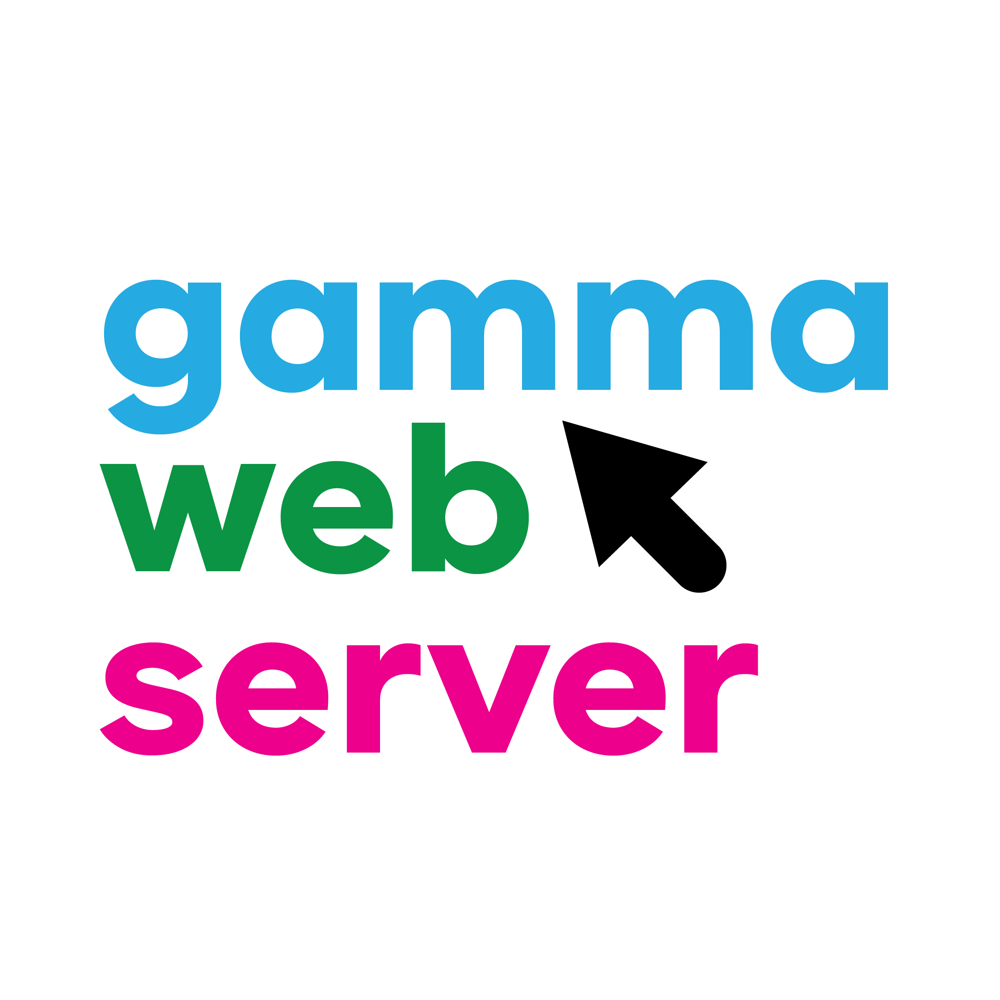

<!-- ALL-CONTRIBUTORS-BADGE:START - Do not remove or modify this section -->
[](#contributors)
<!-- ALL-CONTRIBUTORS-BADGE:END -->

<p align="center">
    <a href="https://www.gammaws.gq" target="_blank">
        
    </a>
</p>

<h4 align="center">A lightweight and fast web server written in Go.</h4>

<p align="center">

<a href="https://github.com/r1c0n/gws/blob/main/LICENSE" target="blank">

</a>
<a href="https://github.com/r1c0n/gws/fork" target="blank">

</a>
<a href="https://github.com/r1c0n/gws/stargazers" target="blank">

</a>
<a href="https://github.com/r1c0n/gws/issues" target="blank">

</a>
<a href="https://github.com/r1c0n/gws/pulls" target="blank">

</a>
<a href="https://app.codacy.com/gh/r1c0n/gws/dashboard?utm_source=gh&utm_medium=referral&utm_content=&utm_campaign=Badge_grade">
    
</a>
<a href="https://twitter.com/intent/tweet?text=👋%20Check%20out%20this%20amazing%20webserver!%20https://github.com/r1c0n/gws"></a>
</p>

## Contents

These are what the different files / directories contain in this repository.

| File/folder       | Description                                | Directory |
|-------------------|--------------------------------------------|-----------|
| `branding`        | Contains Gamma artwork.                    | Yes       |
| `src`             | Source code of Gamma Web Server.           | Yes       |
| `.gitattributes`  | Defines attribute rules for Git repository.| No        |
| `.gitignore`      | Defines what to not commit to Git.         | No        |
| `LICENSE`         | The Gamma Web Server license.              | No        |
| `README.md`       | Before asking questions, read this file.   | No        |
| `SECURITY.md`     | Contains the security policy of Gamma.     | No        |

## Features

- Supports HTTP and HTTPS
- Easy & quick setup
- Easy to use configuration file

## Installation

Download the latest release from GitHub, or find the latest release on our website: [https://www.gammaws.gq](https://www.gammaws.gq)

## Usage

To start Gamma Web Server, double click on the .exe file, or run it through the command-line.

```cmd
.\gws.exe
```

To see your website, visit the link showed on the command-line below the product information. By default, the link is [localhost:8080](localhost:8080).

## Configuration

Gamma Web Server uses a JSON configuration file to customize its behavior. You can specify the port, the document root & more in the configuration file. Find the configuration file in the project's root directory. It will be called **config.json**.

Here is an example of what the **config.json** should look like.

```json
{
    "port": ":80",
    "tls_config": {
      "cert_file": "server.crt",
      "key_file": "server.key"
    },
    "static_dir": "public",
    "repo_config": {
      "version": "1.1.0",
      "author": "Official B",
      "product": "Gamma Web Server",
      "repository": "https://github.com/gamma-gws/gws"
    }
  }  
```

## License

Gamma Web Server is licensed under the GNU General Public License v3.0 - see the [`LICENSE`](LICENSE) file for details.

## Contributors

Thanks goes to these wonderful people ([emoji key](https://allcontributors.org/docs/en/emoji-key)):

<!-- ALL-CONTRIBUTORS-LIST:START - Do not remove or modify this section -->
<!-- prettier-ignore-start -->
<!-- markdownlint-disable -->
<table>
  <tbody>
    <tr>
      <td align="center" valign="top" width="14.28%"><a href="https://www.recon.best"><br /><sub><b>recon</b></sub></a><br /><a href="https://github.com/r1c0n/gws/commits?author=r1c0n" title="Code">💻</a> <a href="https://github.com/r1c0n/gws/commits?author=r1c0n" title="Documentation">📖</a> <a href="#design-r1c0n" title="Design">🎨</a> <a href="#example-r1c0n" title="Examples">💡</a> <a href="#infra-r1c0n" title="Infrastructure (Hosting, Build-Tools, etc)">🚇</a> <a href="https://github.com/r1c0n/gws/pulls?q=is%3Apr+reviewed-by%3Ar1c0n" title="Reviewed Pull Requests">👀</a></td>
      <td align="center" valign="top" width="14.28%"><a href="https://github.com/porokimun"><br /><sub><b>porokimun</b></sub></a><br /><a href="#design-porokimun" title="Design">🎨</a></td>
    </tr>
  </tbody>
</table>

<!-- markdownlint-restore -->
<!-- prettier-ignore-end -->

<!-- ALL-CONTRIBUTORS-LIST:END -->

This project follows the [all-contributors](https://github.com/all-contributors/all-contributors) specification. Contributions of any kind welcome!
